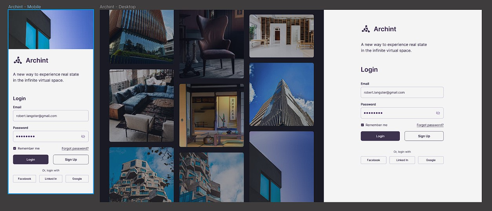

# Teste Técnico de Estágio Frontend

## 📌 Índice

- [Instruções](#-instruções)
- [Requisitos Obrigatórios](#-requisitos-obrigatórios)
- [Requisitos Opcionais (Pontuação Extra)](#-requisitos-opcionais-pontuação-extra)

## 📄 Instruções

1. Você deverá desenvolver, a partir do protótipo no figma disponível nesse [link](<https://www.figma.com/file/o16mnd41KKjbO7uMGVHH7j/Login-UI-Responsive-Template-Mobile-%2B-Web-(Community)?type=design&node-id=0%3A1&mode=design&t=tKxGxjOYJ7W4SlT3-1>), uma tela responsiva e estática seguindo os requisitos listados abaixo.
2. Desenvolva a tela de forma que a mesma fique o mais parecida possível com o protótipo no figma.
3. Depois de desenvolver crie um repositório no seu GitHub pessoal e nele faça o upload do seu projeto, e então nos envie o link do repositório para que possamos avaliar.

## ⚙ Requisitos Obrigatórios

1. Utilize as tecnologias HTML, CSS ou [SCSS](https://sass-lang.com/) e [Reactjs](https://react.dev/) para desenvolver a tela.
2. Para a estilização use apenas CSS ou SCSS. Use um framework React de sua escolha para a criação do projeto. Também é permitido usar qualquer biblioteca do npm que for lhe ajudar no desenvolvimento, exceto bibliotecas de componentes como Bootstrap.
3. Utilize o Git para fazer os commits e também para fazer o upload do projeto no seu Github.
4. A tela deve ser responsiva e o mais parecida possível com o protótipo, incluindo fonte, cores e imagens.

## 🚀 Requisitos Opcionais (Pontuação Extra)

Esses requisitos não são obrigatórios, mas irão lhe garantir uma pontuação extra:

1. Faça o deploy do projeto em alguma plataforma de hospedagem gratuita ([Vercel](https://vercel.com/), [Netlify](https://www.netlify.com/), [Render](https://render.com/)).
2. Coloque no README do projeto as intruções para rodar ele.
3. Utilize linters como [Eslint](https://eslint.org/) e [Prettier](https://prettier.io/).
4. Utilize o framework [NextJS](https://nextjs.org/) para fazer seu projeto.
5. Utilize [SASS](https://sass-lang.com/) para estilização.
